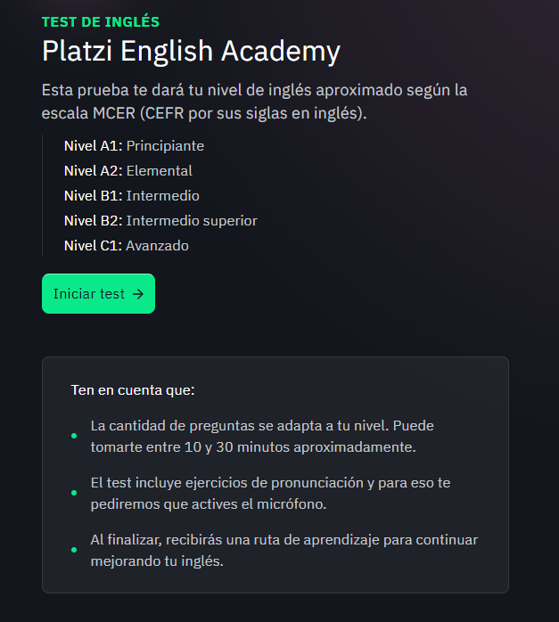
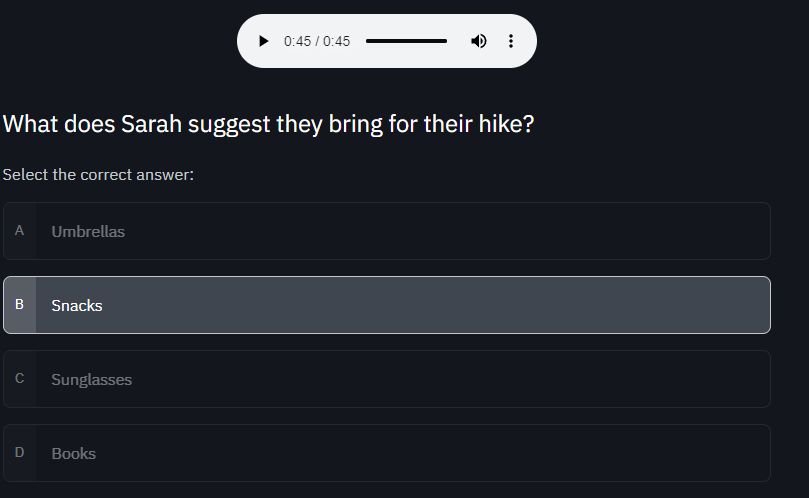
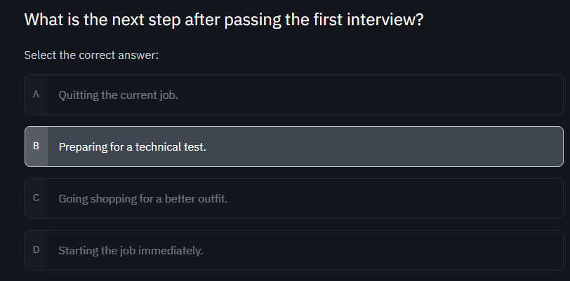
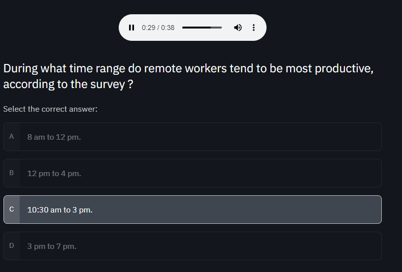

# 1. Aprende ingles en linea de forma efectiva

# 2. Conoce el test de Ingles de Platzi

https://platzi.com/evaluation/test-ingles/

https://static.platzi.com/media/uploads/Placement_Test_Level_A1_Audio_3_e0940713f5.mp3

https://static.platzi.com/media/uploads/Placement_Test_Level_A2_Audio_2_1904454a08.mp3

https://static.platzi.com/media/uploads/Placement_Test_Level_B1_Audio_1_edd5909f0d.mp3

https://static.platzi.com/media/uploads/Placement_Test_Level_A2_Audio_1_43f74d4fc8.mp3

# 3. Identifica como aprendes Ingles

Entender cómo aprenden las personas puede ayudarte a adquirir otro nivel de conocimiento porque puedes sacar al máximo tus fortalezas y superar tus debilidades.

Cuando aprendes tu cerebro se esfuerza por entender nuevas ideas, términos y conceptos, por lo tanto, debe hacer modificaciones en las redes neuronales, esto lo hace por medio de asociaciones y entendimiento con nociones adquiridas anteriormente.

*¿Qué ocurre cuando aprendemos otro idioma?*

Cuando nuestro cerebro se esfuerza por entender otra lengua, lo que generalmente hace es:

- Procesar el lenguaje
- Prestar altos niveles de atención. Lo que ejercita el cerebro

Además, las actividades anteriormente mencionadas evitan el envejecimiento cerebral. Por lo que no solo estaremos aprendiendo un nuevo idioma, sino también cuidando la salud de este órgano.

*Cómo empezar a aprender inglés en 4 pasos*

Algunos pasos para animarnos a aprender otra lengua son:

- Define objetivos y metas claras
- Dedica un tiempo específico para aprender inglés
- Genera un avance progresivo
- Descubre qué te gusta al aprender inglés

*1. Planea objetivos y metas*

Tener los objetivos y metas claras sobre lo que queremos lograr es muy importante en cualquier aspecto de tu vida. Incluso el de la lengua. Algunas preguntas para crearlos son:

- ¿Qué quiero lograr?
- ¿Para qué quiero lograr ello?
- ¿Cómo puedo lograrlo?
- Cuándo lo voy a realizar

Aprender un nuevo lenguaje te exigirá el recurso más preciado de tu vida, tu tiempo, por lo que debes comprometerte para hacer los sacrificios necesarios y lograr que el inglés se vuelva parte de tu vida.

*2. Genera un avance progresivo*

Este punto involucra que puedas modificar el nivel de dificultad de tu ruta de estudio para que no sea ni muy fácil, ni muy difícil. Cumple el reto y poco a poco irás mejorando con un nivel de inglés más alto. Tal como ocurre en un videojuego.

Otro aspecto relevante es que tu avance o estudio del inglés sea constante, de tal forma que estudies 1 hora cada día, en vez de 12 horas cada quien sabe cuando. Estas pequeñas porciones serán mucho más fáciles de digerir y te evitarán la frustración.

*3. Descubre lo qué te gusta al aprender*

Encontrar lo que disfrutas es la base de aprender algo nuevo, pues al identificar el tipo de actividades en las que te sientes a gusto, e incluso disfrutas para aprender inglés, podrás implementar de forma natural este lenguaje a tu rutina diaria.

Las técnicas de aprendizaje que más te funcionen, con las que más aprendas y sientas el progreso, te ayudarán a avanzar de forma más eficiente en tu objetivo de aprender inglés.

*4. Celebra tus pequeñas victorias*

Aprender inglés es un proceso complejo, incluso para aquellos que lo dominan, por eso es muy importante que celebres cuando mejores el nivel de tu segunda lengua, para que sientas que estás avanzando y que valió la pena.

**Reto**

El reto de esta clase está conformado por las siguientes actividades:

- Descargar formulario(https://docs.google.com/document/d/1vjm9Zvh883IBTIhb-kF7vx5RA8kQwmQ9PVON5mkcUFc/edit)

- Llena el formulario (Tomate tu tiempo)

    Plasma tus objetivos

    Escribe tus metas

    Apunta el tiempo que le vas a dedicar

    Describe que actividades disfrutas

    Registra las pequeñas victorias a lo largo de tu aprendizaje

    Realiza el formulario cada 2 o 3 meses (Cambiará a lo largo de tu aprendizaje)

**Conclusión**

Estudiar inglés es un proceso largo y muy personal, realmente tú eres la persona que más conoce sobre ti mismo y puedes usar esto a tu favor, con el fin de encontrar las estrategias y técnicas que más te funcionan.

ChatGPT como asesor para aprender ingles: https://platzi.com/blog/ea-chatgpt-aprender-ingles-gratis/

# 4. ¿Por que aprender ingles?

Actualmente, el inglés es el idioma universal para comunicarse con personas de distintos países sin importar la nacionalidad. ¿Te preguntas por qué es importante aprender inglés? Algunas actividades para las que el inglés es muy importante son:

- Viajar
- El trabajo de tus sueños
- Estudiar en otro país
- Crecimiento personal

*¿Cuál es tu propósito al aprender inglés?*

Aprender un nuevo idioma requiere mucha motivación y sobre todo un gran propósito. Además, las metas que puedes alcanzar con el inglés te pueden dar una razón por la cual luchar y enfrentar todos los obstáculos posibles.

*Qué son los objetivos SMART*

Los objetivos SMART son una muy buena práctica para cumplir tus metas de manera adecuada. Estas siglas significan:

- Specific = Específicos
- Measurable = Medibles
- Achievable = Alcanzables
- Relevant = Relevantes
- Time-based = Basados en tiempo, es decir, que tengan fecha de vencimiento o entrega

*Sigue el progreso de tu nivel de inglés*

Demostrar tu aprendizaje es bastante difícil si no tienes un buen sistema para este objetivo, porque es muy probable que no sientas que estás progresando y quieras abandonarlo todo. Quizás piensas que no estás aprendiendo, pero en realidad no estás midiendo los cambios de la manera adecuada.

Una manera de identificar que estás progresando es grabar cada 5 cursos que tomes en English Academy un video tuyo hablando de lo que más te interesó, durante 3-5 minutos. Cuando tengas más de uno, compáralos y reconoce tus increíbles avances.

*Continúa aprendiendo inglés*

Recuerda que todos los negocios o trabajos que quieras tener en el exterior van a requerir un gran inglés y al aprender un nuevo idioma estás descubriendo una nueva forma de ver al mundo.

“The limits of my language mean the limits of my world” - Ludwig Wittgenstein.

“Los limites de mi lengua marcan los limites de mi mundo” - Ludwing Wittgestein.

# 5. Mitos y verdades a  la hora de aprender ingles

Los mitos son creencias imaginarias que le dan un valor innecesario a las cosas, alterando sus verdaderas y cualidades. La manera de enfrentarlos es entendiendo su lógica, para dejarlos atrás.

*5 mitos sobre aprender inglés*

Lastimosamente, estas creencias pueden crear límites a la hora de aprender inglés que inconscientemente autosabotean nuestro aprendizaje. A continuación conocerás algunos mitos comunes.

*1. Soy demasiado viejo para aprender inglés*

Puedes aprender inglés a cualquier edad, porque el cerebro no ha dejado de desarrollarse gracias a una característica que se llama plasticidad neuronal que nos permite construir nuevas habilidades. Se cree que los niños tienen mayor predisposición al aprendizaje. ¿La razón? No tienen miedo a equivocarse y eso es algo que deberíamos replicar como jóvenes o adultos.

*2. Aprender inglés toma demasiado tiempo*

El tiempo de aprendizaje de inglés es bastante variable porque todo depende del estudiante, su motivación, dedicación y recursos para aprender algo nuevo.

*3. Necesito estar en un país angloparlante para aprender inglés*

Estar en un país angloparlante te daría muchas ventajas, pero si recién estás aprendiendo este idioma es probable que resulte frustrante, además los recursos para estar en otro país serían poco accesibles. Gracias a la globalización puedes sumergirte en otra cultura fácilmente con la tecnología.

- Lee en inglés
- Mira películas en inglés
- Ajusta el sistema operativo de tu computador en inglés
- Escucha música en inglés

Incluso puedes practicar inglés con personas que estén aprendiendo o incluso nativos en algunas plataformas de internet.

*4. No soy bueno o buena para los idiomas*

Claro que existen personas con una facilidad para aprender inglés, como en cualquier otro lugar. Esto no significa que no podamos llegar a un nivel suficiente para desenvolvernos en un ambiente laboral o casual en inglés.

*5. Los acentos son difíciles de imitar*

En vez de sentirnos avergonzados por nuestro acento, deberíamos sentirnos orgullosos de estar comunicándonos en una lengua distinta. Recuerda que cada acento cuenta una historia distinta acerca del origen de una persona y la hace única y la pronunciación se puede desarrollar.

**Conclusión**

En resumen, los mitos pueden ser tan poderosos como les permitamos y estos pueden afectar en gran medida nuestro crecimiento en cualquier habilidad.

“Muchas personas se limitan a si mismas. Tú puedes ir tan lejos como tu mente te lo permita. Tú puedes lograr cualquier cosa que verdaderamente creas que puedas lograr” - Mary Kay Ash

# 6. Rol del estudiante y el profesor en el aprendizaje del ingles

Los diferentes mitos y creencias al aprender inglés han influenciado por años su enseñanza y metodologías. También han cambiado del rol del estudiante y del profesor, que en la actualidad es una fusión integral de todas estas características.

*Metodologías para aprender un nuevo idioma*

Históricamente, la humanidad ha encontrado distintos métodos de enseñar un nuevo idioma que son los que conocerás a continuación.

*1. Método de solo gramática*

La metodología de solo gramática se utilizaba para enseñar lenguas muertas o sin hablantes nativos, como el Latín y el Griego. En estos primaba la traducción y la importante era seguir las reglas gramaticales.

- La comunicación no era relevante

En consecuencia, los profesores memorizaban y enseñaban gramática a sus alumnos.

*2. Método de solo comunicación*

La metodología de solo comunicación consiste en que los profesores están a un segundo plano para ser la guía de los estudiantes.

Los profesores y profesoras solo brindan materiales y aportan consejos.
Sin embargo, dejan de lado un aspecto fundamental que es la gramática para el uso e interiorización del lenguaje.

Estudiar una nueva lengua sin gramática es como una ciudad sin leyes o normas de tránsito, por lo que puede llegar a ser muy desordenada.

*3. Método de enfoque comunicativo moderno*

El método comunicativo moderno combinó los dos métodos anteriores, obteniendo resultados y una estructura muy interesante. Ahora el profesor o profesora:

- Es una guía para estudiantes con recursos y consejos
- Enseña gramática y comunicación.

El único problema de este es que resultaba tener una estructura muy rígida de los que ni el profesor y los estudiantes tenían mayor flexibilidad.

*4. Método contemporáneo*

El método contemporáneo ha sido la aproximación educativa más efectiva hasta el momento cuando hablamos de aprender inglés. Toma de cada una de las distintas partes de aprendizaje y las fusiona.

- Gramática
- Comunicación
- Flexibilidad para los alumnos y profesores.

*Rol del estudiante y el profesor*

Como viste, los roles entre estudiante y profesor han evolucionado con el tiempo. Ahora, con el contexto social, tecnológico, cultural y geográfico de los estudiantes afecta su aprendizaje, este es el rol del estudiante y el profesor.

*Estudiante*

El rol del estudiante dentro del sistema de aprendizaje contemporáneo se caracteriza por tener las siguientes características.

- Participativo
- Curioso
- Motivado
- Interesado por usar sus recursos tecnológicos

*Profesor*

Dentro del nuevo sistema de aprendizaje del inglés contemporáneo se puede percibir que las tareas o deberes del profesor son:

- La guía
- El soporte
- La principal fuente de buena retroalimentación

*¿Qué aporta Platzi a tu aprendizaje del inglés?*

El modelo de Platzi para aprender inglés es tomar las mejores partes de cada método e integrarlo de forma flexible y acompañada por un guía o profesor que brinda el contenido. La comunidad también es fundamental porque los estudiantes se ayudan entre si a aprender durante el proceso.

*1. Gramática*

Platzi cuenta con cursos que te enseñarán las bases de gramática, con excelentes profesores que te estarán acompañando a lo largo de tu aprendizaje, dándote herramientas y recursos para que tú puedas mejorar tus habilidades en inglés.

*2. Comunicación*

Todos los miércoles y viernes encontrarás sesiones en vivo donde puedes practicar tu inglés conversando, para mejorar tu comunicación. Encontrarás profesores para guiar la actividad y que se desarrolle de la mejor manera posible.

*3. Comunidad*

Puedes intercambiar experiencias y potenciar tu aprendizaje con la comunidad de Platzi en los comentarios o el grupo de Discord. ¡Es una gran oportunidad para crear tu red de contactos personales y profesionales en un espacio seguro y confiable!

*4. Flexibilidad*

Por último, puedes aprender a tu propio ritmo, sin preocupaciones de tiempo o calificaciones. Lo importante es que mejores tus habilidades en inglés y que lo puedas soportar con increíbles proyectos,

- Listening
- Reading
- Writing and Speaking

Puedes diseñar tu propia ruta de cursos o seguir la escuela de English Academy diseñada para llevar tu nivel de inglés de 0 a 100.

*La motivación al aprender una segunda lengua*

Aprender una segunda lengua es un proceso desafiante y frustrante. Debes tener claras tus motivaciones o propósitos al aprenderlo porque ese será el motor para que sigas estudiando y veas los resultados del tiempo que estás invirtiendo en aprender.

# 7. Estrategias para aprender ingles

# 8. Aprendiendo ingles en linea

# Fortalece tus competencias

# 9. Evalua tus competencias en el idioma

# 10. La importancia de conocer tu nivel de ingles

# 11. Cuentanos tu plan de estudio

# 12. Ingles para tu crecimiento profesional

# Examen