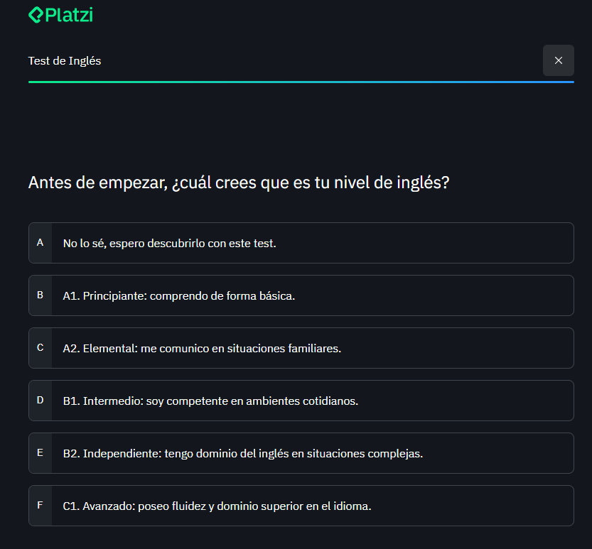
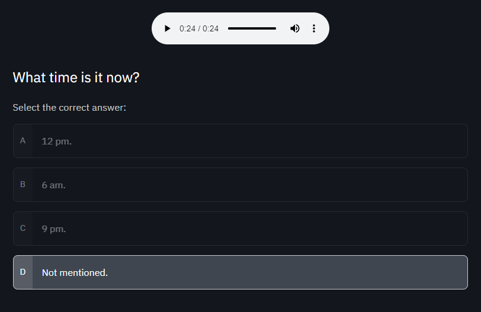
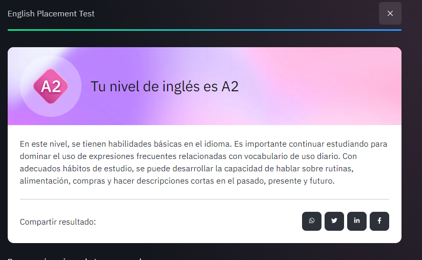
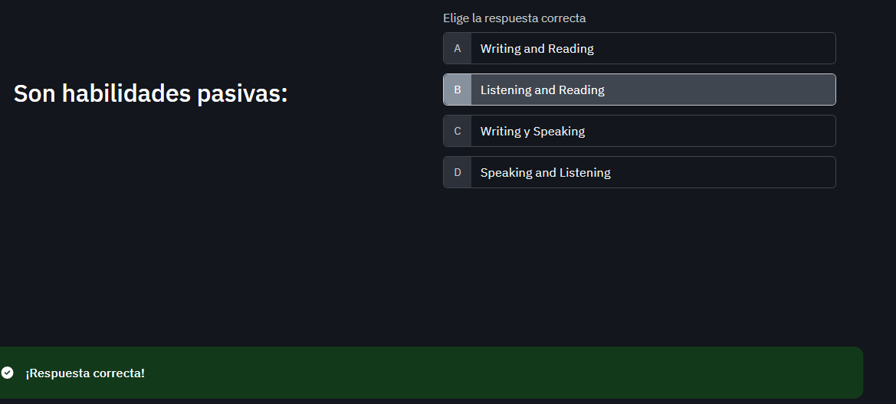
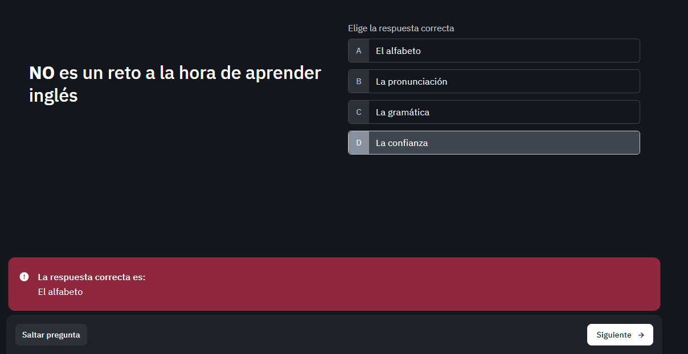
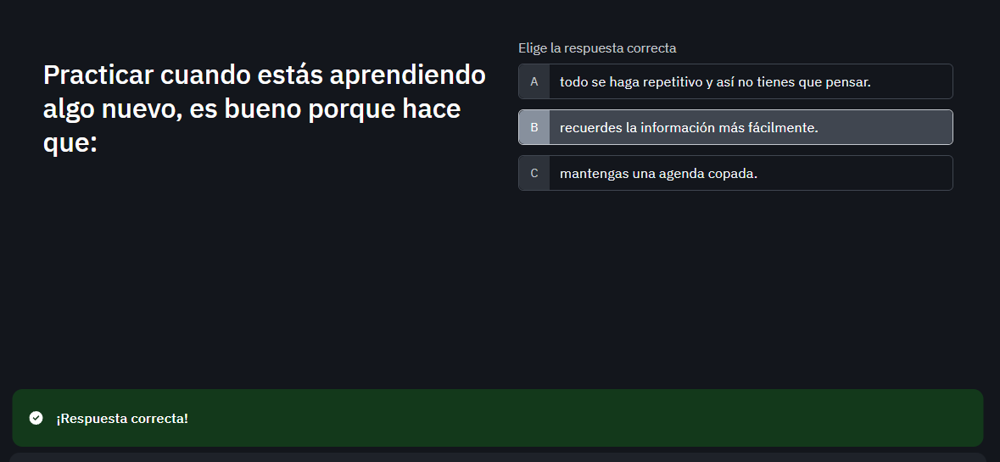

# 1. Aprende ingles en linea de forma efectiva

# 2. Conoce el test de Ingles de Platzi

https://platzi.com/evaluation/test-ingles/

https://static.platzi.com/media/uploads/Placement_Test_Level_A1_Audio_3_e0940713f5.mp3

https://static.platzi.com/media/uploads/Placement_Test_Level_A2_Audio_2_1904454a08.mp3

https://static.platzi.com/media/uploads/Placement_Test_Level_B1_Audio_1_edd5909f0d.mp3

https://static.platzi.com/media/uploads/Placement_Test_Level_A2_Audio_1_43f74d4fc8.mp3

# 3. Identifica como aprendes Ingles

Entender cómo aprenden las personas puede ayudarte a adquirir otro nivel de conocimiento porque puedes sacar al máximo tus fortalezas y superar tus debilidades.

Cuando aprendes tu cerebro se esfuerza por entender nuevas ideas, términos y conceptos, por lo tanto, debe hacer modificaciones en las redes neuronales, esto lo hace por medio de asociaciones y entendimiento con nociones adquiridas anteriormente.

*¿Qué ocurre cuando aprendemos otro idioma?*

Cuando nuestro cerebro se esfuerza por entender otra lengua, lo que generalmente hace es:

- Procesar el lenguaje
- Prestar altos niveles de atención. Lo que ejercita el cerebro

Además, las actividades anteriormente mencionadas evitan el envejecimiento cerebral. Por lo que no solo estaremos aprendiendo un nuevo idioma, sino también cuidando la salud de este órgano.

*Cómo empezar a aprender inglés en 4 pasos*

Algunos pasos para animarnos a aprender otra lengua son:

- Define objetivos y metas claras
- Dedica un tiempo específico para aprender inglés
- Genera un avance progresivo
- Descubre qué te gusta al aprender inglés

*1. Planea objetivos y metas*

Tener los objetivos y metas claras sobre lo que queremos lograr es muy importante en cualquier aspecto de tu vida. Incluso el de la lengua. Algunas preguntas para crearlos son:

- ¿Qué quiero lograr?
- ¿Para qué quiero lograr ello?
- ¿Cómo puedo lograrlo?
- Cuándo lo voy a realizar

Aprender un nuevo lenguaje te exigirá el recurso más preciado de tu vida, tu tiempo, por lo que debes comprometerte para hacer los sacrificios necesarios y lograr que el inglés se vuelva parte de tu vida.

*2. Genera un avance progresivo*

Este punto involucra que puedas modificar el nivel de dificultad de tu ruta de estudio para que no sea ni muy fácil, ni muy difícil. Cumple el reto y poco a poco irás mejorando con un nivel de inglés más alto. Tal como ocurre en un videojuego.

Otro aspecto relevante es que tu avance o estudio del inglés sea constante, de tal forma que estudies 1 hora cada día, en vez de 12 horas cada quien sabe cuando. Estas pequeñas porciones serán mucho más fáciles de digerir y te evitarán la frustración.

*3. Descubre lo qué te gusta al aprender*

Encontrar lo que disfrutas es la base de aprender algo nuevo, pues al identificar el tipo de actividades en las que te sientes a gusto, e incluso disfrutas para aprender inglés, podrás implementar de forma natural este lenguaje a tu rutina diaria.

Las técnicas de aprendizaje que más te funcionen, con las que más aprendas y sientas el progreso, te ayudarán a avanzar de forma más eficiente en tu objetivo de aprender inglés.

*4. Celebra tus pequeñas victorias*

Aprender inglés es un proceso complejo, incluso para aquellos que lo dominan, por eso es muy importante que celebres cuando mejores el nivel de tu segunda lengua, para que sientas que estás avanzando y que valió la pena.

**Reto**

El reto de esta clase está conformado por las siguientes actividades:

- Descargar formulario(https://docs.google.com/document/d/1vjm9Zvh883IBTIhb-kF7vx5RA8kQwmQ9PVON5mkcUFc/edit)

- Llena el formulario (Tomate tu tiempo)

    Plasma tus objetivos

    Escribe tus metas

    Apunta el tiempo que le vas a dedicar

    Describe que actividades disfrutas

    Registra las pequeñas victorias a lo largo de tu aprendizaje

    Realiza el formulario cada 2 o 3 meses (Cambiará a lo largo de tu aprendizaje)

**Conclusión**

Estudiar inglés es un proceso largo y muy personal, realmente tú eres la persona que más conoce sobre ti mismo y puedes usar esto a tu favor, con el fin de encontrar las estrategias y técnicas que más te funcionan.

ChatGPT como asesor para aprender ingles: https://platzi.com/blog/ea-chatgpt-aprender-ingles-gratis/

# 4. ¿Por que aprender ingles?

Actualmente, el inglés es el idioma universal para comunicarse con personas de distintos países sin importar la nacionalidad. ¿Te preguntas por qué es importante aprender inglés? Algunas actividades para las que el inglés es muy importante son:

- Viajar
- El trabajo de tus sueños
- Estudiar en otro país
- Crecimiento personal

*¿Cuál es tu propósito al aprender inglés?*

Aprender un nuevo idioma requiere mucha motivación y sobre todo un gran propósito. Además, las metas que puedes alcanzar con el inglés te pueden dar una razón por la cual luchar y enfrentar todos los obstáculos posibles.

*Qué son los objetivos SMART*

Los objetivos SMART son una muy buena práctica para cumplir tus metas de manera adecuada. Estas siglas significan:

- Specific = Específicos
- Measurable = Medibles
- Achievable = Alcanzables
- Relevant = Relevantes
- Time-based = Basados en tiempo, es decir, que tengan fecha de vencimiento o entrega

*Sigue el progreso de tu nivel de inglés*

Demostrar tu aprendizaje es bastante difícil si no tienes un buen sistema para este objetivo, porque es muy probable que no sientas que estás progresando y quieras abandonarlo todo. Quizás piensas que no estás aprendiendo, pero en realidad no estás midiendo los cambios de la manera adecuada.

Una manera de identificar que estás progresando es grabar cada 5 cursos que tomes en English Academy un video tuyo hablando de lo que más te interesó, durante 3-5 minutos. Cuando tengas más de uno, compáralos y reconoce tus increíbles avances.

*Continúa aprendiendo inglés*

Recuerda que todos los negocios o trabajos que quieras tener en el exterior van a requerir un gran inglés y al aprender un nuevo idioma estás descubriendo una nueva forma de ver al mundo.

“The limits of my language mean the limits of my world” - Ludwig Wittgenstein.

“Los limites de mi lengua marcan los limites de mi mundo” - Ludwing Wittgestein.

# 5. Mitos y verdades a  la hora de aprender ingles

Los mitos son creencias imaginarias que le dan un valor innecesario a las cosas, alterando sus verdaderas y cualidades. La manera de enfrentarlos es entendiendo su lógica, para dejarlos atrás.

*5 mitos sobre aprender inglés*

Lastimosamente, estas creencias pueden crear límites a la hora de aprender inglés que inconscientemente autosabotean nuestro aprendizaje. A continuación conocerás algunos mitos comunes.

*1. Soy demasiado viejo para aprender inglés*

Puedes aprender inglés a cualquier edad, porque el cerebro no ha dejado de desarrollarse gracias a una característica que se llama plasticidad neuronal que nos permite construir nuevas habilidades. Se cree que los niños tienen mayor predisposición al aprendizaje. ¿La razón? No tienen miedo a equivocarse y eso es algo que deberíamos replicar como jóvenes o adultos.

*2. Aprender inglés toma demasiado tiempo*

El tiempo de aprendizaje de inglés es bastante variable porque todo depende del estudiante, su motivación, dedicación y recursos para aprender algo nuevo.

*3. Necesito estar en un país angloparlante para aprender inglés*

Estar en un país angloparlante te daría muchas ventajas, pero si recién estás aprendiendo este idioma es probable que resulte frustrante, además los recursos para estar en otro país serían poco accesibles. Gracias a la globalización puedes sumergirte en otra cultura fácilmente con la tecnología.

- Lee en inglés
- Mira películas en inglés
- Ajusta el sistema operativo de tu computador en inglés
- Escucha música en inglés

Incluso puedes practicar inglés con personas que estén aprendiendo o incluso nativos en algunas plataformas de internet.

*4. No soy bueno o buena para los idiomas*

Claro que existen personas con una facilidad para aprender inglés, como en cualquier otro lugar. Esto no significa que no podamos llegar a un nivel suficiente para desenvolvernos en un ambiente laboral o casual en inglés.

*5. Los acentos son difíciles de imitar*

En vez de sentirnos avergonzados por nuestro acento, deberíamos sentirnos orgullosos de estar comunicándonos en una lengua distinta. Recuerda que cada acento cuenta una historia distinta acerca del origen de una persona y la hace única y la pronunciación se puede desarrollar.

**Conclusión**

En resumen, los mitos pueden ser tan poderosos como les permitamos y estos pueden afectar en gran medida nuestro crecimiento en cualquier habilidad.

“Muchas personas se limitan a si mismas. Tú puedes ir tan lejos como tu mente te lo permita. Tú puedes lograr cualquier cosa que verdaderamente creas que puedas lograr” - Mary Kay Ash

# 6. Rol del estudiante y el profesor en el aprendizaje del ingles

Los diferentes mitos y creencias al aprender inglés han influenciado por años su enseñanza y metodologías. También han cambiado del rol del estudiante y del profesor, que en la actualidad es una fusión integral de todas estas características.

*Metodologías para aprender un nuevo idioma*

Históricamente, la humanidad ha encontrado distintos métodos de enseñar un nuevo idioma que son los que conocerás a continuación.

*1. Método de solo gramática*

La metodología de solo gramática se utilizaba para enseñar lenguas muertas o sin hablantes nativos, como el Latín y el Griego. En estos primaba la traducción y la importante era seguir las reglas gramaticales.

- La comunicación no era relevante

En consecuencia, los profesores memorizaban y enseñaban gramática a sus alumnos.

*2. Método de solo comunicación*

La metodología de solo comunicación consiste en que los profesores están a un segundo plano para ser la guía de los estudiantes.

Los profesores y profesoras solo brindan materiales y aportan consejos.
Sin embargo, dejan de lado un aspecto fundamental que es la gramática para el uso e interiorización del lenguaje.

Estudiar una nueva lengua sin gramática es como una ciudad sin leyes o normas de tránsito, por lo que puede llegar a ser muy desordenada.

*3. Método de enfoque comunicativo moderno*

El método comunicativo moderno combinó los dos métodos anteriores, obteniendo resultados y una estructura muy interesante. Ahora el profesor o profesora:

- Es una guía para estudiantes con recursos y consejos
- Enseña gramática y comunicación.

El único problema de este es que resultaba tener una estructura muy rígida de los que ni el profesor y los estudiantes tenían mayor flexibilidad.

*4. Método contemporáneo*

El método contemporáneo ha sido la aproximación educativa más efectiva hasta el momento cuando hablamos de aprender inglés. Toma de cada una de las distintas partes de aprendizaje y las fusiona.

- Gramática
- Comunicación
- Flexibilidad para los alumnos y profesores.

*Rol del estudiante y el profesor*

Como viste, los roles entre estudiante y profesor han evolucionado con el tiempo. Ahora, con el contexto social, tecnológico, cultural y geográfico de los estudiantes afecta su aprendizaje, este es el rol del estudiante y el profesor.

*Estudiante*

El rol del estudiante dentro del sistema de aprendizaje contemporáneo se caracteriza por tener las siguientes características.

- Participativo
- Curioso
- Motivado
- Interesado por usar sus recursos tecnológicos

*Profesor*

Dentro del nuevo sistema de aprendizaje del inglés contemporáneo se puede percibir que las tareas o deberes del profesor son:

- La guía
- El soporte
- La principal fuente de buena retroalimentación

*¿Qué aporta Platzi a tu aprendizaje del inglés?*

El modelo de Platzi para aprender inglés es tomar las mejores partes de cada método e integrarlo de forma flexible y acompañada por un guía o profesor que brinda el contenido. La comunidad también es fundamental porque los estudiantes se ayudan entre si a aprender durante el proceso.

*1. Gramática*

Platzi cuenta con cursos que te enseñarán las bases de gramática, con excelentes profesores que te estarán acompañando a lo largo de tu aprendizaje, dándote herramientas y recursos para que tú puedas mejorar tus habilidades en inglés.

*2. Comunicación*

Todos los miércoles y viernes encontrarás sesiones en vivo donde puedes practicar tu inglés conversando, para mejorar tu comunicación. Encontrarás profesores para guiar la actividad y que se desarrolle de la mejor manera posible.

*3. Comunidad*

Puedes intercambiar experiencias y potenciar tu aprendizaje con la comunidad de Platzi en los comentarios o el grupo de Discord. ¡Es una gran oportunidad para crear tu red de contactos personales y profesionales en un espacio seguro y confiable!

*4. Flexibilidad*

Por último, puedes aprender a tu propio ritmo, sin preocupaciones de tiempo o calificaciones. Lo importante es que mejores tus habilidades en inglés y que lo puedas soportar con increíbles proyectos,

- Listening
- Reading
- Writing and Speaking

Puedes diseñar tu propia ruta de cursos o seguir la escuela de English Academy diseñada para llevar tu nivel de inglés de 0 a 100.

*La motivación al aprender una segunda lengua*

Aprender una segunda lengua es un proceso desafiante y frustrante. Debes tener claras tus motivaciones o propósitos al aprenderlo porque ese será el motor para que sigas estudiando y veas los resultados del tiempo que estás invirtiendo en aprender.

# 7. Estrategias para aprender ingles

Existen bastantes sistemas para aprender nuevas cosas de manera efectiva. Conoce cuáles son los fundamentos detrás de estos métodos de estudio para encontrar cuál se adapta a tus necesidades.

*¿Qué es una estrategia de estudio?*

Una estrategia de estudio es un conjunto de actividades técnicas para aprender nuevos temas y conceptos acerca de un tema de estudio de una o un estudiante. 📚

*Características de una estrategia de estudio*

Lo que caracteriza a una estrategia de estudio es lo siguiente:

- Promueve el autoconocimiento: Conceptualizar áreas de mejora, Fortalezas, Identificar propia manera efectiva de aprender

- Guía o mapa que se diseña para aprender algo 🗺️

*Importancia de una estrategia de estudio*

Las estrategias de estudio son importantes porque ayudan a comprender temas de una forma más eficiente al reducir el tiempo innecesario invertido en aprender algo que no genera resultados. Además, esta metodología ejercita la mente con nuevos temas para aprender y nos ayudan a alcanzar grandes objetivos ⭐.

*Diferencia entre técnica y estrategia*

La diferencia entre estos dos conceptos básicamente es que una técnica hace referencia a una actividad individual, en cambio, la estrategia es un conjunto de técnicas ordenadas especialmente para alcanzar un objetivo. 🤔

*Técnicas de estudio para aprender inglés en línea*

Los pasos para estudiar y aprender inglés en línea son los siguientes.

*1. Lee y comprende*

La técnica de leer y comprender consiste en tomar una lectura referente al tema que nos interese y leer atentamente, para luego intentar comprenderla y estructurarla en nuestra mente. 📖

*2. Resume y construye un esquema*

Luego de realizar la lectura, se sacan las ideas más importantes del texto para luego posicionarlas visualmente en un esquema o también explicar con nuestras propias palabras las ideas en un escrito corto acerca del tema. 📑

*3. Memoriza*

La técnica de momorización busca retener en nuestra mente los conocimientos adquiridos por medio de la lectura, comprensión, esquema y resumen. Para lograrlo efectivamente debemos tener en cuenta los 4 siguientes conceptos: 🧠

- Repetición
- Concentración
- Orden
- Lógica

# 8. Aprendiendo ingles en linea

A la hora de dominar un nuevo idioma debes desarrollar ciertas habilidades que te ayudarán a entender mejor los conceptos y términos nuevos que estás estudiando.

- Pasive (Pasivas): Listening (Escuchar), Reading (Leer)
- Active (Activas): Speaking (Hablar), Writing (Escribir)

*Estrategias para aprender en línea*

Algunos de los obstáculos más comunes para aprender un nuevo idioma como el inglés son:

- Creer que el inglés se lee como se escribe
- Tener miedo a los sonidos diferentes
- Falta de vocabulario
- Incomprensión de reglas gramaticales
- Falta de seguridad y confianza

*Cómo mejorar tus habilidades de listening*

A continuación tienes la ténicas que hacen parte la estrategia para mejorar tu habilidad de escucha en inglés.

- Mira series + películas + cartoons
- Escucha música + podcast
- Entra a grupos de conversación
- Escucha audiolibros

*Cómo mejorar tus habilidades en reading*

Revisa con cuidado las distintas técnicas que plantea la estrategia para incrementar tu nivel de lectura en inglés.

- Libros adaptados
- Comics + biografías
- Noticias + revistas + blogs
- Audiolibros

*Cómo mejorar tus habilidades en speaking*

Para mejorar tu pronunciación y capacidad de transmitir mensajes en inglés, práctica las siguientes técnicas:

- Leer en voz alta
- Suéltate a la hora de hablar
- Conversaciones habituales en inglés
- Memoriza, trabalenguas y poesía

*Cómo mejorar tus habilidades en writing*

Mejora tu escritura en inglés con las siguientes técnicas:

- Leer todo lo que puedas
- Crea un diccionario personal
- Expande tus oraciones
- Empieza un blog personal, participa en chats y foros de internet

**Conclusión**

En síntesis, aprender en línea nos es nada fácil, pero tampoco imposible. Además, al implementar las estrategias adecuadas puedes enfrentar los retos que comúnmente se presentan y obtener resultados fantásticos.

# Fortalece tus competencias

# 9. Evalua tus competencias en el idioma

Evaluar es la forma de medir los conocimientos, habilidades y rendimiento adquiridos en un proceso de aprendizaje en cualquier campo de conocimiento, por ejemplo, el idioma inglés. 📏

*¿Por qué evaluar mis competencias en inglés?*

Dentro de nuestro aprendizaje es muy importante saber como estamos progresando sobre aquello en lo que estamos estudiando, de tal forma que podamos identificar y sacar beneficio a los 3 elementos clave que nos regala evaluar lo aprendido, que son:

- Entender 💡
- corregir ✔️
- Avanzar ✈️

La retroalimentación nos brindan la oportunidad de saber en qué nivel de aprendizaje nos encontramos, para poder mejorar nuestro perfil.

*3 formas de medir tu nivel de inglés*

Dentro del mundo del inglés existen varias formas de evaluar nuestro conocimiento, así que conozcámoslas:

*1. Proceso de autoevaluación*

El proceso de autoevaluación se caracteriza por ponerse a prueba uno mismo o la persona por sí misma. De tal manera que identifique en que nivel de su aprendizaje se encuentra. Debería realizarse en periodos de 3 a 4 meses porque si se hace muy seguido puedes frustrarte.

*2. Test de clasificación*

Los test de clasificación se hacen al principio de cualquier proceso de aprendizaje, porque ayuda a reconocer en donde se encuentra el estudiante y planear sobre nuevos objetivos y su nivel.

Los exámenes de clasificación no se deben hacer muy seguido, porque en vez de evaluar el conocimiento real, podemos entrar a jugar con nuestra memoria.

*3. Exámenes internacionales*

Los exámenes internacionales son una radiografía que indican en que nivel de inglés nos encontramos actualmente. Estos suelen ser muy variados y temporales, debido a que nuestro nivel cambia según la practica o el uso a lo largo del tiempo.

Ejemplos:

- TOEFL
- IELTS
- TOEIC
- MET
- Cambridge exams

*Marco común Europeo de referencia para lenguas*

El marco común Europeo fue creado para estandarizar el nivel de una persona de acuerdo a las siguientes categorías que miden la habilidad y desenvolvimiento de la persona en distintos contextos.

*A1-A2* 🐣

El nivel A1-A2 dice que es dependiente de fuentes externas para generar su material en el idioma.

*B1-B2* 🐤

B1-B2 demuestra que la persona es más independientes de las fuentes externas, pero de igual forma se ven limitados en algunos contextos de la lengua.

*C1-C2* 🐓

El nivel C1-C2 demuestra que la persona es muy capaz de comunicarse y desenvolverse en cualquier situación en la lengua.

**Conclusión**

En suma, saber que debes mejorar te dan un superpoder para enfocarte en ello y seguir adelante con tu aprendizaje. De manera específica y objetiva.

# 10. La importancia de conocer tu nivel de ingles

Cuando sabes tu nivel de inglés, puedes avanzar de forma adecuada en tu ruta de aprendizaje y planear cuáles son tus metas a mediano y largo plazo. Conoce a continuación algunos consejos para practicar un nuevo idioma.

Si aún no conoces tu nivel de inglés, ve a nuestro Test de Inglés de Platzi y descúbrelo. 🚀 (https://platzi.com/evaluation/test-ingles/)

*1. Mide tu progreso* 📏

Medir la forma en la que aprendes una habilidad es una de las cosas que más ayuda a nuestra motivación, porque nos ayuda a comprobar que estamos progresando y que nuestro tiempo y esfuerzo vale la pena. Piensa en todas esas áreas que podrías mejorar.

*2. Estudia de manera eficiente* 📊

Al conocer tu nivel de inglés tienes claros los temas que debes aprender para avanzar en tu camino y hacerlo de la forma más eficaz. Olvida aquellos días donde practicabas sin tener una meta en tu mente y organiza todos tus logros con un plan de acción.

*3. Desarrolla tu confianza* 💪

Cuando presentas los exámenes que te certifican en una legenda extranjera puedes sentirte más cómodo o cómoda al comunicarte con extranjeros o personas que ya dominan ese nuevo idioma que estás aprendiendo.

*4. Mejora tu comunicación* 🚩

Las entrevistas en inglés te pueden ayudar a mejorar tu comunicación y ser más claro o clara al expresar cuál es tu nivel de inglés con el fin de acceder a un nuevo trabajo o asumir nuevos retos profesionales.

**Conclusión**
Para sintetizar, al conocer tu nivel de inglés, tienes muy claro en qué nivel de inglés estás y para donde vas. De tal forma que puedes avanzar de la manera más eficaz posible.

# 11. Cuentanos tu plan de estudio

# 12. Ingles para tu crecimiento profesional

Durante este camino de practicar inglés descubriste a una gran comunidad que no le tiene miedo a aprender. No importa si estás en un nivel A1 o menor, en Platzi nunca es tarde para superarte y conocer nuevos idiomas para conseguir un perfil profesional más competitivo.

*¿Qué aprendiste?*

Este es solo el principio de una gran aventura que te ayudará a entender el mundo desde una perspectiva global. Algunos de los temas que viste fueron:

- ¿Por qué el inglés es necesario?
- Las verdades y mitos al aprender inglés
- El rol del estudiante y el profesor
- Estrategias para aprender inglés en línea
- Cómo evaluar tu progreso
- Cómo y de que forma avanzar según tu nivel de inglés actual
- Los recursos que te ofrece Platzi para aprender a tu ritmo

# Examen