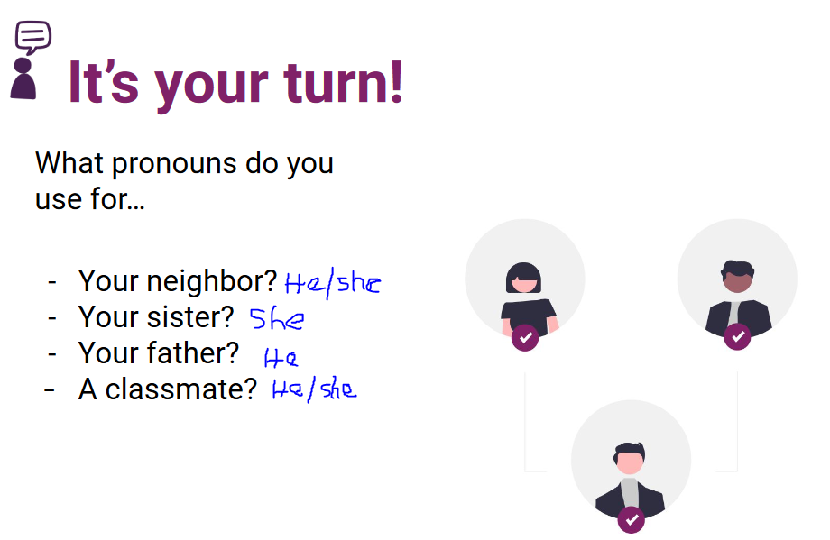

# CURSO DE INGLES BASICO A1 PARA PRINCIPIANTES

# 1. Aprende las bases del ingles

# 2. Articulos indefinidos en ingles: "a" y "an"

En inglés, "a" se usa antes de palabras que empiezan con un sonido consonante, como en "a cat" o "a university" (porque "university" comienza con el sonido /juː/). "An" se usa antes de palabras que empiezan con un sonido vocal, como en "an apple" o "an hour" (porque "hour" comienza con el sonido /aʊ/). La excepción principal es con palabras que comienzan con una vocal escrita pero tienen un sonido consonante, como en "a uniform."

# 3. El alfabeto en ingles: guia de pronunciacion

# 4. ¿Como usar "it's" en ingles?

Se usa para hacer declaraciones o descripciones.

- "It's raining outside." (Está lloviendo afuera.)
- "It's a beautiful day." (Es un día hermoso.)

# 5. Sustantivos plurales en ingles

- Bus - Buses
- Glass - Glasses
- Class - Classes
- Dress - Dresses
- Kiss - Kisses

- Book - Books
- Car - Cars
- Dog - Dogs
- Pen - Pens
- Tree - Trees

- Brush - Brushes
- Dish - Dishes
- Wish - Wishes

- Church - Churches
- Peach - Peaches
- Lunch - Lunches
- Watch - Watches

- Box - Boxes
- Fox - Foxes
- Mix - Mixes

- Waltz - Waltzes
- Fizz - Fizzes

Vowel + Y = S:

    Boy - Boys
    Day - Days
    Toy - Toys
    Key - Keys
    Way - Ways

Consonant + Y = IES:

    City - Cities
    Country - Countries
    Family - Families
    Baby - Babies
    Story - Stories

Man - Men
Woman - Women
Child - Children
Foot - Feet
Tooth - Teeth
Mouse - Mice
Goose - Geese
Person - People

# 6. ¿Como usar "there are" en ingles?

# Quiz Module 1

# 7. Numeros en ingles: 1 a 100

# 8. Colores en ingles

Rojo - red

# 9. Pronombres personales en ingles

Una parte esencial del aprendizaje del inglés son los pronombres personales. Veamos qué son los pronombres personales y su importancia en la construcción de frases.

*¿Qué son los pronombres personales y por qué son importantes?*

Los pronombres personales en inglés son aquellas palabras que sustituyen a los sustantivos para referirse a las personas, animales o cosas sin tener que nombrarlas repetidamente. Son fundamentales al hablar o escribir, ya que facilitan la comunicación y la hacen más fluida.

*¿Cuál es la relación entre pronombres personales y los verbos?*

Cada pronombre personal se acompaña de un verbo en una forma única que concuerda con él. Por ejemplo, "I am" (Yo soy) o "She is" (Ella es). Aquí una guía rápida de referencia:

    - "I am" (Yo soy)
    - "You are" (Tú eres)
    - "He is" (Él es)
    - "She is" (Ella es)
    - "It is" (Eso es)
    - "We are" (Nosotros somos)
    - "They are" (Ellos son)

Ahora practiquemos con los siguientes ejemplos:

    - "I am" (Yo soy): I am a student.
    - "You are" (Tú eres): You are my best friend.
    - "He is" (Él es): He is a talented musician.
    - "She is" (Ella es): She is a skilled painter.
    - "It is" (Eso es): It is a beautiful day outside.
    - "We are" (Nosotros somos): We are a team working on a project.
    - "They are" (Ellos/ellas son): They are passionate about environmental issues.

¿Por qué el pronombre "you" es especial?

A diferencia de otros idiomas, el inglés utiliza "you" tanto en singular como en plural. Esto significa que se puede referir a una persona ("You are talented", Tú eres talentoso) o a varias ("You are all invited", Todos ustedes están invitados).

*El uso de "she","he" y"they"*

Cada uno de estos pronombres tiene un propósito específico:

    - "She" se usa para las personas que se identifican como femeninas.
    - "He" para aquellos que se identifican como masculinos.
    - "They" es especial, ya que puede ser usado tanto para el plural como en singular para referirse a personas que no se identifican dentro del binomio masculino/femenino.

*¿Cómo utilizamos "it" en inglés?*

"It" es el pronombre personal que se usa para referirse a objetos o cosas sin vida. Por ejemplo, se dice "It is a car" para hablar de un coche.

    - Sabías que también se puede usar "it" cuando nos referimos a objetos, ideas o situaciones sin género específico, observa la siguiente oración: "Look at the sky. It's so clear today."
    - También se puede utilizar "it" para referirnos a animales de manera general o cuando el género del animal es desconocido, por ejemplo: "I saw a cat in the garden. It looked friendly."
    - Se utiliza "it" para describir situaciones climáticas y momentos específicos en el tiempo, por ejemplo: "What's the weather like today? Is it raining?"
    - Para realizar referencias a algo mencionado en una conversación se puede utilizar "it" por ejemplo: "I bought a new phone. It has a powerful camera."
    - En construcciones impersonales, "it" se utiliza para expresar situaciones generales o impersonales. Por ejemplo: "It is said that he will arrive late."
    - "It" a menudo se utiliza para referirse a eventos o situaciones que se mencionarán o discutirán más adelante en la conversación. Por ejemplo: "We have a meeting at 3 pm. It will be in the conference room."

*Ejercicio práctico*

Ahora es tu turno de poner en práctica lo aprendido. ¿Qué pronombres utilizarías para referirte a tu vecino, tu hermana, tu padre o un compañero de clase? Anímate a escribir tus respuestas en la sección de comentarios, comparte con la comunidad tus ejercicios.

El dominio de los pronombres personales es un paso crucial en el camino hacia la fluidez en inglés. No dudes en repasar y practicar constantemente, y recuerda, la comunidad de aprendizaje está aquí para apoyarte en este emocionante viaje lingüístico. 

¿Porque "They" puede ser singular?

Cuando nos referimos a una tercera persona y no conocemos si su pronombre es he o she se suele usar they.

Por ejemplo, la oración comió arroz se podría poner como:

    He/she ate rice.
    They ate rice.

# 10. Profesiones en ingles

- Teacher - Maestro/a
- Doctor - Doctor/a
- Nurse - Enfermero/a
- Engineer - Ingeniero/a
- Lawyer - Abogado/a
- Architect - Arquitecto/a
- Chef - Chef/Cocinero/a
- Mechanic - Mecánico/a
- Dentist - Dentista
- Artist - Artista
- Musician - Músico/a
- Photographer - Fotógrafo/a
- Journalist - Periodista
- Farmer - Granjero/a
- Plumber - Fontanero/a
- Electrician - Electricista
- Scientist - Científico/a
- Pilot - Piloto/a
- Firefighter - Bombero/a
- Librarian - Bibliotecario/a

- Graphic Designer - Diseñador/a Gráfico/a
- Web Developer - Desarrollador/a Web
- UI/UX Designer - Diseñador/a de Interfaz de Usuario (UI) y Experiencia de Usuario (UX)
- Software Engineer - Ingeniero/a de Software
- Systems Analyst - Analista de Sistemas
- Data Scientist - Científico/a de Datos
- Industrial Engineer - Ingeniero/a Industrial
- Mechanical Engineer - Ingeniero/a Mecánico/a
- Civil Engineer - Ingeniero/a Civil
- Electrical Engineer - Ingeniero/a Eléctrico/a

# Quiz module 2

# 11. ¿Como usar isn't y aren't?

# 12. Preguntas usando "who"

# 13. Adjetivos posesibvos en ingles

# 14. Saludos y despedidas en ingles

# Quiz Module 3

# 15. ¿Como hacer preguntas usando what's?

# 16. Hobies en ingles

# 17. ¿Como hacer preguntas basicas en ingles?

# 18. Dias de la semana en ingles

# Quiz Module 4

# 19. Crea tu perfil personal en ingles

# 20. Continua practicando tu ingles

# Examen