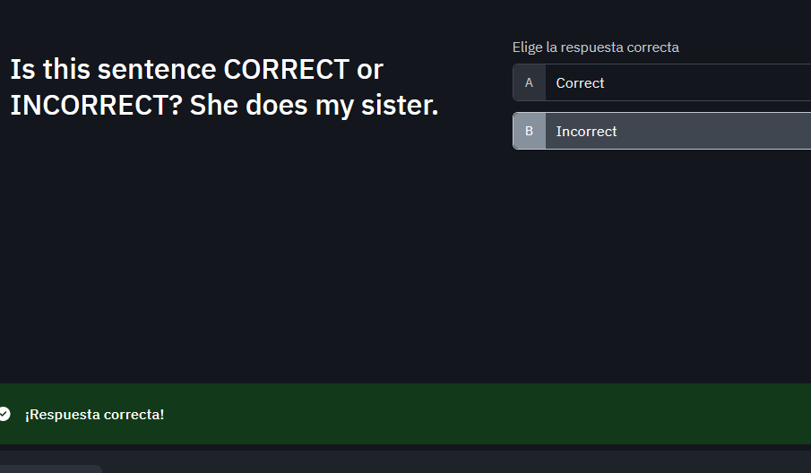
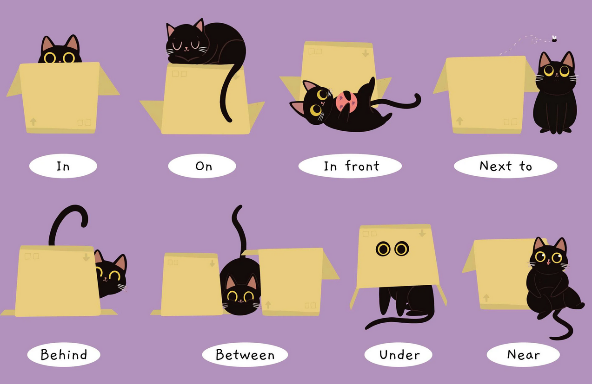
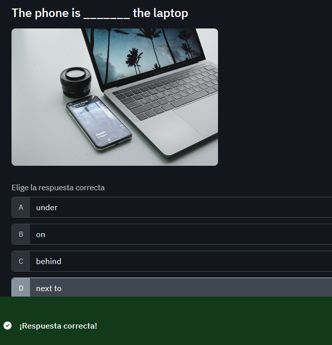
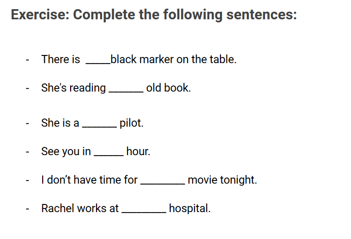
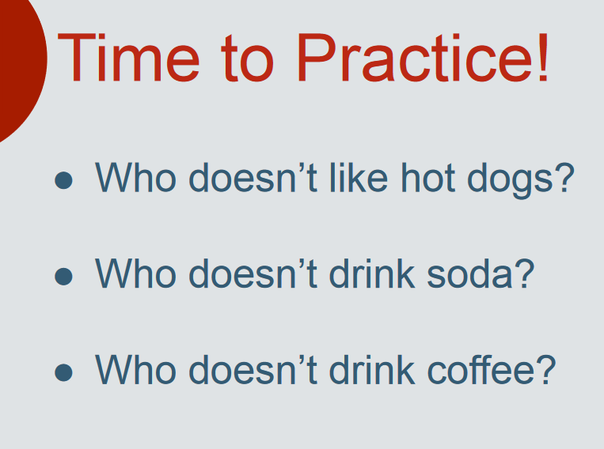
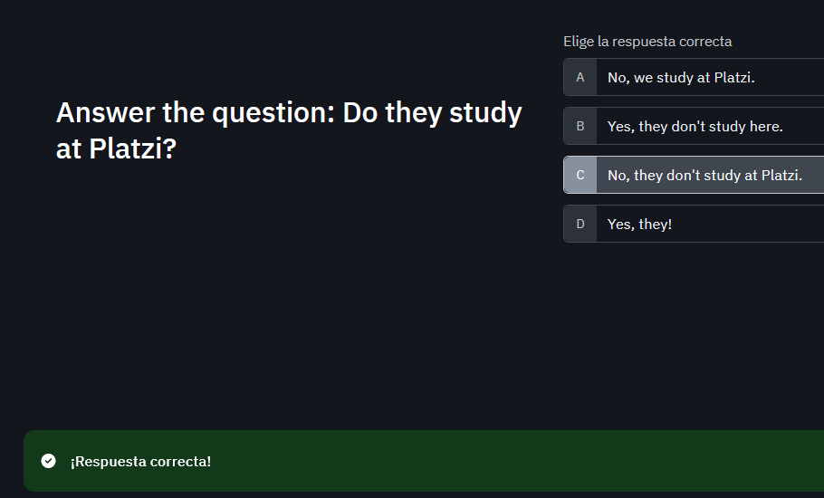
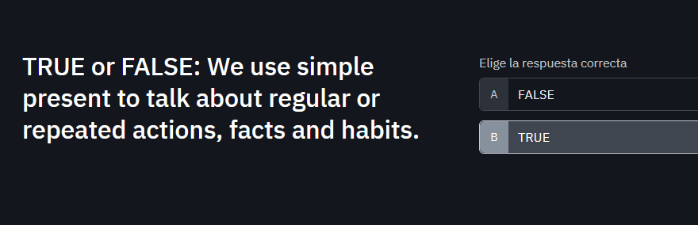
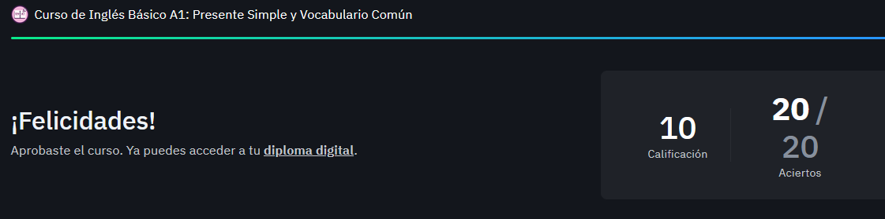

# CURSO DE INGLES BASICO A1: PRESENTE SIMPLE Y VOCABULARIO COMUN

# 1. Domina el ingles basico

En este curso aprenderás a:

- Presentarte a ti mismo y a otras personas / Introduce yourself and others.
- Usar el verbo to be y otros verbos / Use the verb to be and others verbs.
- Utilizar el tiempo presente simple / Use the simple present tense.
- Hacer preguntas simples / Make simple questions.
- Usar el vocabulario básico y común / Use basic and common vocabulary.
- Usar algunas preposiciones / Use some prepositions.
- Usar algunos sustantivos irregulares / Use some irregular nouns.

# 2. Presenta a otras personas en ingles

Para presentar a otras personas se debe tener especial cuidado con estas dos palabras:

**This (singular form)**

Se usa para presentar a una persona.

Ejemplo:

Ella es mi esposa - This is my wife.

**These (plural form)**

Se usa para presentar a varias personas.

Ejemplo:

Ellos son mis hijos - These are my kids.

**Roleplay**

A continuación, se presenta una conversación donde se ejemplifica la manera correcta de presentar a otras personas.

**John:** Hi, my name is John and this is my friend Cesar.
**Cesar:** Hi, my name is Cesar. I’m a full-stack developer. I’m 24 years old and I’m Colombian and this is my friend Elena.
**Elena:** My name is Elena. I’m 30 years old, I’m Colombian-American, I’m a teacher and this is my friend Anna.
**Anna:** Hi!, I’m Anna, I’m a teacher, I’m 25 years old and I’m Honduran.

Para referirse a todos ellos (plural) como sus amigos, John debe decir:

**These are** my friends!

**Tarea:**

**Nick:** Hi, my name is Nick and this is my sister Gloria.
**Gloria:** Hi, my name is Gloria. I'm a medical technologist. I'm 30 years old and I'm Peruvian and this is my sister Lucero.
**Lucero:** Hi, my name is Lucero, I'm a student. I'm 20 years old and I'm Colo mmbian and this is my father Walter.
**Walter:** Hi, my name is Walter. I'm a welder. I'm 55 years old and I'm Bolivian and this is my friend Coco.
**Coco:** Hi, my name is Coco. I'm software engineer. I'm 31 years old and I'm Italian.

These are my family and my friends

# 3. Presentate en ingles

Hay cuatro aspectos importantes para presentarse a otras personas:

    Nombre - Name
    Nacionalidad - Nationality
    Ocupación - Job / Occupation
    Edad- Age

El orden de estos aspectos no es importante. Se pueden decir en cualquier orden, según la preferencia de los interlocutores.

Ejemplo:

Hi, my name is John. I am Colombian. I am 27 years old, and I am a teacher. I work at Platzi.

En este ejemplo se observa el cumplimiento de los elementos esenciales:

    Name: Hi, my name is John.
    Nationality: I am Colombian.
    Age: I am 27 yeras old
    Job / Occupation: I am a teacher. I work at Platzi.

Cada persona puede agregar otros aspectos si lo desea.

**Tarea:**

Hi, my name is Nick. I'm 31 years old. I'm Peruvian and I work as a software engineer.

# 4. Quiz Module 1

# 5. Como usar el verbo "to be"

El tiempo presente simple se usa de dos maneras:

    Con el **verbo to be**
    Con otros verbos.

En esta oportunidad, vamos a estudiar el tiempo presente simple usando el verbo to be.

El verbo to be es muy importante y significa ser o estar. Este verbo adquiere tres formas en el tiempo presente simple:

    Am
    Is
    Are

En la conjugación de este verbo puedes verificar estas tres formas:

- I am
- You are
- He is
- She is
- It is
- You are
- We are
- They are

**Cuándo se usa el verbo to be**

El verbo to be se usa en las siguientes ocasiones:

    Cuando quieres decir características de las personas, por ejemplo:

    I am Peter.
    You are from Venezuela.
    He is 30 years old.

    Para decir detalles acerca de las personas, incluyendo emociones y características, por ejemplo:

    I am a man
    You are an important person
    He is happy

**Uso del verbo to be en oraciones afirmativas**

Estructura gramatical: Pronoun + to be + complement

- I am happy / I’m happy.
- You are happy / You’re happy.
- He is happy / He’s happy.
- She is happy / She’s happy.
- You are happy / You’re happy.
- We are happy / We’re happy.
- They are happy / They’re happy.

**Uso del verbo to be en oraciones negativas**

Estructura gramatical: Pronoun + to be + not + complement

- I am not happy / I’m not happy.
- You are not happy / You aren’t happy.
- He is not happy / He isn’t happy.
- She is not happy / She isn’t happy.
- You are not happy / You aren´t happy.
- We are not happy / We aren’t happy.
- They are not happy / They aren’t happy.

**Uso del verbo to be en oraciones interrogativas**

Estructura gramatical: To be + pronoun + complement + ?

En las oraciones interrogativas el orden de la estructura gramatical cambia. Primero se usa el verbo to be y después el pronombre.

- Am I happy?
- Are you happy?
- Is he happy?
- Is she happy?
- Are you happy?
- Are we happy?
- Are they happy?

**Otros ejemplos usando el verbo to be**

    Is he an important person?
    • Yes, he is.
    • No, he isn´t (Negación en forma corta)
    • No, he isn’t an important person (Negación en forma larga)

    Am I a teacher?
    • Yes, you are.
    • No, you aren´t (Negación en forma corta)
    • No, you aren´t a teacher. (Negación en forma larga)

El pronombre IT se usa para referirse a animales, objetos o cosas. Por ejemplo:

A hamburger is delicious

    Affirmative form: It is delicious.
    Negative form: It isn’t delicious.
    Interrogative form: Is it delicious?

Recursos:

https://static.platzi.com/media/public/uploads/lectura-adjectives_d557f773-5cf1-41c6-a9ff-c483ec3bc8d0.pdf

https://static.platzi.com/media/public/uploads/slides-curso-de-ingles-basico-a1-presente-simple-y-vocabulario-comun-pptx_2a4fd443-ffc5-46a9-8cf2-9e5d5bc36ff5.pdf

Tarea:

- Correct. 
- Incorrect. I'm at home
- Incorrect. Is he sad?
- Incorrect. We are not American
- Correct

# 6. Presente simple con otros verbos en ingles

En la clase anterior se explicó el tiempo presente simple usando el verbo to be. Ahora, vamos a estudiar usando otros verbos diferentes como, por ejemplo, go, play, visit, cook, run, wake up, etc.

**Uso de presente simple en oraciones afirmativas, negativas e interrogativas**

El uso del tiempo presente simple tiene diferentes maneras según se trate de oraciones afirmativas, negativas o interrogativas.

**Oraciones afirmativas con distintos verbos**

Estructura gramatical:

    I/You/We/They + verb + Complement
    He/She/It + Verb + s/es/ies + Complement

Ejemplos de oraciones afirmativas:

    I watch TV.
    You watch TV.
    He watches TV.
    She watches TV.
    You watch TV.
    We watch TV.
    They watch TV.

Cuando se trata de los pronombres he, she, it, al verbo se le agrega una letra o un grupo de letras (s, es, ies), por ejemplo:

    I play soccer.
    She plays soccer.

    You listen to music.
    He listens to music.

    We watch TV.
    She watches TV.

    They study English.
    He studies English.

Importante: Esta situación solo ocurre en las oraciones afirmativas. Para saber las letras que se deben agregar existen las siguientes reglas:

    A la mayoría de los verbos solo se le agrega la letra “s”, por ejemplo:

    Read - Reads

    Run – Runs

    Cook – Cooks

    Love – Loves

    Cuando el verbo termina en la consonante “y”, se cambia la letra “y” por “ies”, por ejemplo:

    Try – Tries

    Carry – Carries

    Study – Studies

    Cuando el verbo termina en las consonantes “s”, “z”, “ch” o “x”, se agrega “es”, por ejemplo:

    Miss – misses

    Buzz – Buzzes

    Catch – Catches

    Fix – Fixes

    Hay algunas excepciones a estas reglas, por ejemplo:

    Go – goes

    Do – does

    Have - has

Let’s practice:

    We live in Colombia.
    He/she lives in Colombia

    I work at Platzi.
    He/she works at Platzi.

    They play the guitar.
    He/she plays the guitar.

    You eat pizza.
    He/she eats pizza.

**Oraciones negativas con distintos verbos**

Estructura gramatical:

    I/You/We/They + do not / don’t + Verb + Complement
    He/She/It + does not / doesn’t + Verb + Complement

En las oraciones negativas del tiempo presente simple se usa el verbo auxiliar Do / Does.
Ejemplos de oraciones negativas:

    She plays soccer.
    She doesn’t play soccer (fíjate que el verbo retoma su forma original sin la letra s al final).

    I listen to music.
    I don’t listen to music.

    He cooks very well.
    He doesn’t cook very well.

    They write letters.
    They don’t write letters.

**Oraciones interrogativas con distintos verbos**

Estructura gramatical:

    Do + I/You/We/They+ Verb + Complement + ?
    Does + He/She/It + Verb + Complement + ?

En las oraciones interrogativas del tiempo presente simple el verbo auxiliar do/does se coloca al principio de la oración.
Ejemplos de oraciones interrogativas:

    Do you speak English?
    Yes, I do.
    No, I don’t speak English.

    Do you walk to the park?
    Yes, I do.
    No, I don’t.

    Does he reads a lot?
    Yes, he does.
    No, he doesn’t read a lot.

    Do they like sushi?
    Yes, they do.
    No, they don’t.

En conclusión, las tres modalidades del tiempo presente simple son:

Affirmative: I watch TV
Negative: I don’t watch TV
Interrogative: Do you watch TV?

**Tarea 1:**

- Mary likes to play tennis
- We cook delicious cakes
- I eat a lot
- He lives in the forest
- Charles studies English

**Tarea 2:**

- He/She lives in Colombia
- He/She works at Platzi
- He/She plays the guitar
- He/She eats Pizza

**Tarea 3:**

- Yes, I do play any musical instrument
- Yes, I do eat vegetables
- No, I don't live in an apartment
- No, I don't speak spanish

# 7. Describe personas en ingles

**Tarea:**

This is my mather. She is 55 years old. She lives in Lima and works in social assistance. She likes to cook and eat seafood. She doesn't like being in closed places, but she does like going to the park. She doesn't speak English but would like to learn Quechua. I love my mom!

# 8. Describe tu rutina diaria en ingles

Lee con detenimiento la rutina que se encuentra a continuación:

I wake up at 9 o’clock, and the first thing I do is make breakfast. Then, I have breakfast with my brother, clean up the dishes that I get for cooking, then I spend time with my computer at Platzi for over 3 hours. After that, I get dressed and go to the gym at my daily schedule. Later on, I go back home and take lunch with my brother. Following that, I take a shower and go to the office to check on my job. Then, I arrive home to have dinner and watch some shows in English on Netflix for practicing this new language. Finally, at 11 o’clock, I go to sleep.

Ahora, anímate a redactar tu propia rutina. Te puedes guiar por el ejemplo anterior y puedes usar el material complementario para encontrar vocabulario.

Recursos: https://static.platzi.com/media/public/uploads/lectura-daily-routine-actions_422d013c-b3ca-4768-8eef-6181846749a2.pdf

My daily routine

*DESCRIPCION 1:*

I wake up at 8 o'clock and immediately take a shower. Then, I make breakfast and go to study. I start work at 11 and work on my computer. I watch YouTube videos at 12 and then return to my programming studies. I go to bed at 11 p.m.

*DESCRIPCION 2*

I wake up at 8:00 a.m. and turn off my alarm at that time. Then, I head to my computer to study programming and English courses. After that, at 11:00 a.m., I go to prepare my breakfast. At 12:00 p.m., I resume my studies until 4:00 p.m., when I go to have my lunch. After lunch, I return to my studies. At 11:00 p.m., I have dinner, which is tea with 2 pieces of bread and cheese. Then, I go back to my room and go to sleep.

# 9. Describe la rutina de alguien en ingles

Te invito a leer la siguiente convesación entre Jessica y Will. Pon atención al uso de los verbos.

- Jessica: Hey, Will. How are you?
- Will: Hi, Jessica. I’m Good.
- Jessica: Nice, Will. Tell me, what’s your daily routine?
- Will: I wake up at 7 a.m. and I brush my teeth. I read my favorite book and I take a shower. I go to work and I have lunch there. I come back home at 6:00 p.m. I cook dinner and I watch TV.
- Jessica: Amazing, Will. Thank you.

En la conversación anterior, Will dijo su rutina diaria.

Ahora, te invito a cambiar la redacción en tercera persona del singular con el fin de practicar el uso de los verbos en presente simple para el pronombre he.

Atrévete a hacerlo por tu cuenta. No mires la respuesta que está abajo sin haberlo intentado.

*Tarea 1:*
He wakes up at 7 a.m. and he brushes his teeth. He reads his favorite book, and he takes a shower. He goes to work and he has lunch there. He comes back home at 6:00 p.m. He cooks dinner and he watches TV.

*Tarea 2:*
She wakes up at 8:00 a.m. and turns off her alarm. She takes a shower at 9:00 a.m. and makes breakfast with her mom. She goes to work at 11:00 a.m. and starts work at 12:00 p.m. She finishes work at 6:00 p.m. and arrives home at 8:00 p.m. She cooks dinner for herself and her boyfriend and watches TV. She goes to bed at 11:00 p.m.

# Module 2

# 10. Preposiciones de lugar en ingles

Las preposiciones de lugar dan información sobre la ubicación o localización de algo. Las preposiciones más comunes son:

| Preposition in English | Preposición en español |
|------------------------|------------------------|
|In|En / dentro
|On 	|Sobre
|Above 	|Encima de
|In front of 	|En frente de / delante de
|Next to 	|Al lado
|Behind 	|Detrás de
|Between 	|Entre
|Under 	|Debajo
|Below 	|Debajo (sin contacto)
|Near 	|Cerca

**Diferencia entre las preposiciones on y above**

On significa ““sobre la superficie de algo””, pero con el objeto tocando esa superficie, ya sea de manera horizontal o vertical, por ejemplo:

    The cup of coffee is on the table.
    The pictures are on the wall.
    The laptop is on the table.

En cambio, above significa encima, pero más distante de la superficie:

    There is a sign above the door.
    The birds are flying above the houses.

Diferencia entre las preposiciones below y under

Below significa ““debajo””, pero más distante de la superficie, mientras que under está próxima a la superficie.

    The submarine is below sea level.
    The paper is under the book.

Recurso: https://static.platzi.com/media/public/uploads/lectura-prepositions-of-place_8d634c54-ccdd-4c9a-9d0f-bef305b80cc4.pdf

*Tarea 1:*

¿Donde estas en este momento?
- I'm in front of my computer
- I'm sitting on the chair
- I'm near the printer

¿Donde esta tu computador?
- My computer is in front of me
- My computer is on the table
- My computer is between my printer and my microphone

¿Donde esta tu cama?
- My bed is behind me
- My bed is set on the ground
- My bed is in my room 

# 11. Preguntas con "wh" en el presente simple

**WH Questions Structure**

WH questions in the simple present use “do” or “be”. Take a look at the structure for each of these verbs.
**

    Do/Does
    WH + DO/DOES + SUBJECT + VERB

Take a look at some examples:

Where do you work?
When does she wake up?
Who is your brother?

    Verb To-Be
    WH + BE + SUBJECT

Here are the examples:

- Where are you from?
- Who is that man?
- When is your class?

Las WH questions son preguntas cuya respuesta no puede ser cerrada (sí o no). Estas inician con palabras que incluyen las letras w y h como Who o Where.

**Principales WH Questions**

Hay varios tipos de WH Questions. Algunas de las más comunes son las siguientes:

**Who**

Se usa para preguntar sobre personas (people).

    Who is that person in the window?
    Who is that woman?
    Who is your brother?
    Who is your favorite writer?

**Where**

Se usa para preguntar sobre lugares (places).

    Where is the supermarket?
    Where does she live?
    Where are my car keys?
    Where is the elevator?
    Where is your pet?

**When**

Se usa para preguntar sobre un espacio temporal o momento en el tiempo (times).

    When is your class?
    When is your birthday?
    When do you go to the gym?
    When do you study your English class?
    When does she wake up?

**What**

Se usa para preguntar sobre un objeto o sobre varios aspectos en general (things).

    What is your phone number?
    What time is your class? (This is another question for time)
    What’s your name?
    What is your favorite beach?
    What time is it?
    What is that?

**Why**

Se usa para pedir información sobre algo, pedir justificación, motivos, amerita un razonamiento (reasons).

    Why do you do that?
    Why not?
    Why do you study English?
    Why does she look so happy?

**Which**

Se usa para solicitar información que amerita escoger entre opciones (options). La pregunta presenta pocas opciones de respuesta. Se diferencia de What en que esta última es más general y sus opciones de respuestas son muy amplias.

    Which is your favorite color, blue or black?
    Which of these do you like best?
    Which one is your dog?
    Which is the correct answer?
    Which of these cars do you prefer? Red or White?

*Tarea:*
- Where is the car? / Where do you live?
- Who is this person? / Who plans to go tomorrow? (¿Quien planea ir mañana?)
- When is the party? / When does he arrive?
- What is your phone number? / What does your book say?
- Why are you a good person? / Why do you buy unnecesary things?
- Which is the favorite program, A or B? / Which one reached the goal first?

# 12. Practica tu listening en ingles

Recurso: https://static.platzi.com/media/public/uploads/answer-key-where-are-they__c01b5fe5-b930-425d-a316-9322df4f2096.pdf

*Persona 1:*
- What's his name?: Jess
- Where is he?: Sydney
- What's his job?: He is a professional photographer
- Where do they live?: He lives in Canada

*Persona 2:*
- What's his name?: Ravee
- Where is he?: In New York
- What's his job?: He is a veterinarian and manager of pizza restaurant
- Where do they live?: He lives in New York

*Persona 3:*
- What's her name?: Elena
- Where is she?: She is in Russia
- What's her job?: She is a tour guide and journalist
- Where does she live?: She lives in Argentina

# Module 3

# 13. Diferencia entre have y has

Have y Has tienen exactamente el mismo significado, pero Has se usa con los pronombres personales He, She, It en las oraciones afirmativas.

I have
You have
He has
She has
It has
You have
We have
They have

**Uso de Have y Has en oraciones afirmativas**

    I/You/We/They + Have
    He/She/It + Has

Por ejemplo:

    I have a dog
    You have a dog
    He has a dog
    She has a dog
    They have a dog

**Uso de Have y Has en oraciones negativas**

    I/You/We/They + Don’t + Have
    He/She/It + Doesn’t + Have

Por ejemplo:

    I don’t have a dog
    You don’t have a dog
    He doesn’t have a dog
    She doesn’t have a dog
    They don’t have a dog

Se observa que en las oraciones negativas siempre se usa have, solo cambia el auxiliar don’t o doesn’t.

**Uso de Have y Has en oraciones interrogativas**

    Do + I/You/We/The + Have … ?
    Does + He/She/It + Have … ?

Por ejemplo:

    Do I have a dog?
    Do you have a dog?
    Does he have a dog?
    Does she have a dog?
    Do they have a dog?

Se observa que en las oraciones interrogativas siempre se usa have, solo cambia el auxiliar do o does.

*Solucion de la tarea:*

- You don't have a good job / do you have a good job?
- She doesn't have 2 brothers / does she have 2 brothers?
- They don't have a cat / do they have a cat?
- He doesn't have a new cell phone / does he have a new cell phone

# 14. Plurales irregulares en ingles

Generalmente a los sustantivos (nouns) se les agrega “s” para transformarlos en plural, por ejemplo:

Book – Books
Paper – Papers
Apple – Apples
Key - Keys

Sin embargo, en algunas ocasiones existen reglas diferentes.

**Plural de sustantivos terminados en la letra y**

Cuando los sustantivos culminan con la letra “y” y esta es precedida por una consonante, la letra “y” es sustituida por “ies”. Por ejemplo:

    Story – Stories.
    Strawberry – Strawberries.
    Candy – Candies

**Plural de sustantivos terminados en las letras ch, x, s, sh, o**

Cuando los sustantivos culminan con las letras “ch”, “x”, “s”, “sh”, “o”, se agrega “es”; por ejemplo:

    Beach – Beaches
    Class – Classes
    Box – Boxes
    Brush – Brushes
    Tomato – Tomatoes

**Plural de sustantivos terminados en las letras f, fe, lf**

Cuando las palabras culminan con las letras “f”, “fe”, “lf”, estas se sustituyen por “ves”; por ejemplo:

    Knife – Knives
    Life - Lives
    Wolf – Wolves

**Plural de sustantivos irregulares**

Existen sustantivos en los cuales su plural es totalmente diferente a las formas anteriores (Irregular plural nouns), por ejemplo:

Man – Men
Mouse – Mice
Louse – Lice
Bison – Bison
Woman – Women
Policeman - Policemen
Child – Children
Person – People
Fish – Fish
Tooth – Teeth
Goose – Geese
Sheep – Sheep
Moose – Moose
Foot – Feet
Ox – Oxen
Deer – Deer
Offspring – Offspring

Recurso: https://static.platzi.com/media/public/uploads/lectura_-irregular-plural-nouns_39ec6ab9-e372-4d3f-b8ec-3016822f054f.pdf

# 15. Practica con verbos en presente simple

*Resolucion de practica:*

- My brother has 2 guitars
- I don't live in Colombia
- Do you have a car or a dog?
- Excuse me, where is the bank?
- They don't have much free time
- Suzzie doesn't drink milk with her meals
- We cook sushi on Mondays
- Does Charles speak french?
- Tom and Matt work in a big company
- He has a new computer

# 16. Verbos imperativos en ingles

Los verbos en forma imperativa se usan para dar:

    Instrucciones.
    Órdenes.
    Consejos.

Consisten en frases con el verbo en infinitivo sin estar acompañadas de un sujeto. Indican una acción directa. Por ejemplo:

- Come here! - ¡Ven aquí!
- Sit down! - ¡Siéntate!
- Don´t go! - ¡No te vayas!
- Look out! - ¡Cuidado!
- Close the door, please - Cierra la puerta, por favor.
- Switch the TV off - Apaga la televisión.
- Put the flour, milk and eggs in a bowl - Pon la harina, la leche y los huevos en un bol.
- Take a selfie and post it on Twitter - Hazte una selfie y publícala en Twitter. 

# 17. Como usan "and" y "but"

- And. Se usa para conectar ideas similares.
- But. Se utiliza para contrastar ideas.

**Ejemplos del uso de and y but:**

- I love traveling by car and I love traveling by plane. (Conectar ideas similares)
- I like pizza, but I don’t like to eat hamburgers. (Contrastar ideas)
- I don’t have plants in my house, but I have a beautiful dog. (Contrastar ideas).

*Tarea: 5 oraciones con and y 5 oraciones con but*

- I like take a shower, but I don't like go to the party.
- He likes apples, but he doesn't like oranges (A él le gustan las manzanas, pero no le gustan las naranjas.)
- I can help you, but I need more time (puedo ayudarte pero necesito mas tiempo)
- The book is thick, but it's very interesting (El libro es grueso, pero es muy interesante.)
- The restaurant is expensive, but the food is delicious (El restaurante es caro, pero la comida es deliciosa.)

- I like coffee and tea
- She is reading a book and listening to music
- They are studying hard and preparing for exams (Ellos están estudiando mucho y preparándose para los exámenes)
- I need to buy bread and milk ((Necesito comprar pan y leche.))
- He is tall and strong (Él es alto y fuerte.)
- She writes letters and draws pictures (Ella escribe cartas y dibuja cuadros.)

# 18. Cuando usar "a" y "an"

Se usa “a” antes de las palabras que tienen un sonido consonante. Se usa “an” antes de las palabras que comienza con un sonido vocal:

    A mechanic
    An apple
    A doctor
    An economist

Importante. Es el sonido de la palabra que le sigue la que determina si se usa A o An. No se trata de que la palabra inicie en vocal o no.

Por ejemplo.

A university. En este caso, aunque University comienza en vocal su sonido es similar a “yours”

An hour. En este caso, la “h” es muda, por tal motivo se usa “an” en lugar de “a”.
Principales usos de A y AN

Los usos principales de a y an son:

1. Identificar que se trata de una sola cantidad de algo (singular):

    I need a car.
    I want an apple.

2. Delante de las profesiones:

    She’s an actress.
    He’s a photographer.

Solucion de la tarea:

- a
- an
- a
- an
- a
- a

# Module 4

# 19. Expresa preferencias con "like" y "don't like"

Resolucion:

- Jhon doesn't like hot dogs
- Jhon doesn't drink soda
- Anna doesn't drink coffee

# 20. Ejercicios adicionales de gramatica en ingles

Recuerda

    Usamos el tiempo presente simple para hablar sobre acciones, hechos y hábitos regulares y rutinarios.
    Los auxiliares do y does nunca se usan con el verbo to be. Solo se usan con el resto de los verbos.
    Necesitamos añadir las letras -s, -es, -ies a las acciones en oraciones afirmativas de la tercera persona del singular (he, she, it). Nunca se agregan estas terminaciones en las oraciones negativas e interrogativas.

Practica usando cada pronombre personal (I, you, he, she, it, we and they) escribiendo oraciones en forma afirmativa, negativa e interrogativa. Hazlo con el verbo to be y otros verbos.

¡Felicitaciones por haber llegado al final de este curso!

# Module 5

# 21. Ahora dominas el presente simple en ingles

En este curso vimos varios temas de inglés básico que incluyeron:

    Cómo presentarte ante otras personas.
    Cómo usar el verbo to be y otros verbos.
    Cómo utilizar el tiempo presente simple.
    Cómo hacer WH questions.
    Cómo usar algunas preposiciones.
    Cómo usar algunos sustantivos irregulares.

EXAMEN:

