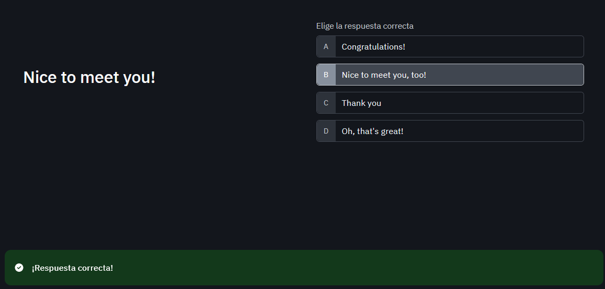

# CURSO DE INGLES BASICO A1: PRESENTE SIMPLE Y VOCABULARIO COMUN

# 1. Domina el ingles basico

En este curso aprenderás a:

- Presentarte a ti mismo y a otras personas / Introduce yourself and others.
- Usar el verbo to be y otros verbos / Use the verb to be and others verbs.
- Utilizar el tiempo presente simple / Use the simple present tense.
- Hacer preguntas simples / Make simple questions.
- Usar el vocabulario básico y común / Use basic and common vocabulary.
- Usar algunas preposiciones / Use some prepositions.
- Usar algunos sustantivos irregulares / Use some irregular nouns.

# 2. Presenta a otras personas en ingles

Para presentar a otras personas se debe tener especial cuidado con estas dos palabras:

**This (singular form)**

Se usa para presentar a una persona.

Ejemplo:

Ella es mi esposa - This is my wife.

**These (plural form)**

Se usa para presentar a varias personas.

Ejemplo:

Ellos son mis hijos - These are my kids.

**Roleplay**

A continuación, se presenta una conversación donde se ejemplifica la manera correcta de presentar a otras personas.

**John:** Hi, my name is John and this is my friend Cesar.
**Cesar:** Hi, my name is Cesar. I’m a full-stack developer. I’m 24 years old and I’m Colombian and this is my friend Elena.
**Elena:** My name is Elena. I’m 30 years old, I’m Colombian-American, I’m a teacher and this is my friend Anna.
**Anna:** Hi!, I’m Anna, I’m a teacher, I’m 25 years old and I’m Honduran.

Para referirse a todos ellos (plural) como sus amigos, John debe decir:

**These are** my friends!

**Tarea:**

**Nick:** Hi, my name is Nick and this is my sister Gloria.
**Gloria:** Hi, my name is Gloria. I'm a medical technologist. I'm 30 years old and I'm Peruvian and this is my sister Lucero.
**Lucero:** Hi, my name is Lucero, I'm a student. I'm 20 years old and I'm Colo mmbian and this is my father Walter.
**Walter:** Hi, my name is Walter. I'm a welder. I'm 55 years old and I'm Bolivian and this is my friend Coco.
**Coco:** Hi, my name is Coco. I'm software engineer. I'm 31 years old and I'm Italian.

These are my family and my friends

# 3. Presentate en ingles

Hay cuatro aspectos importantes para presentarse a otras personas:

    Nombre - Name
    Nacionalidad - Nationality
    Ocupación - Job / Occupation
    Edad- Age

El orden de estos aspectos no es importante. Se pueden decir en cualquier orden, según la preferencia de los interlocutores.

Ejemplo:

Hi, my name is John. I am Colombian. I am 27 years old, and I am a teacher. I work at Platzi.

En este ejemplo se observa el cumplimiento de los elementos esenciales:

    Name: Hi, my name is John.
    Nationality: I am Colombian.
    Age: I am 27 yeras old
    Job / Occupation: I am a teacher. I work at Platzi.

Cada persona puede agregar otros aspectos si lo desea.

**Tarea:**

Hi, my name is Nick. I'm 31 years old. I'm Peruvian and I work as a software engineer.

# 4. Quiz Module 1

# 5. Como usar el verbo "to be"

El tiempo presente simple se usa de dos maneras:

    Con el **verbo to be**
    Con otros verbos.

En esta oportunidad, vamos a estudiar el tiempo presente simple usando el verbo to be.

El verbo to be es muy importante y significa ser o estar. Este verbo adquiere tres formas en el tiempo presente simple:

    Am
    Is
    Are

En la conjugación de este verbo puedes verificar estas tres formas:

- I am
- You are
- He is
- She is
- It is
- You are
- We are
- They are

**Cuándo se usa el verbo to be**

El verbo to be se usa en las siguientes ocasiones:

    Cuando quieres decir características de las personas, por ejemplo:

    I am Peter.
    You are from Venezuela.
    He is 30 years old.

    Para decir detalles acerca de las personas, incluyendo emociones y características, por ejemplo:

    I am a man
    You are an important person
    He is happy

**Uso del verbo to be en oraciones afirmativas**

Estructura gramatical: Pronoun + to be + complement

- I am happy / I’m happy.
- You are happy / You’re happy.
- He is happy / He’s happy.
- She is happy / She’s happy.
- You are happy / You’re happy.
- We are happy / We’re happy.
- They are happy / They’re happy.

**Uso del verbo to be en oraciones negativas**

Estructura gramatical: Pronoun + to be + not + complement

- I am not happy / I’m not happy.
- You are not happy / You aren’t happy.
- He is not happy / He isn’t happy.
- She is not happy / She isn’t happy.
- You are not happy / You aren´t happy.
- We are not happy / We aren’t happy.
- They are not happy / They aren’t happy.

**Uso del verbo to be en oraciones interrogativas**

Estructura gramatical: To be + pronoun + complement + ?

En las oraciones interrogativas el orden de la estructura gramatical cambia. Primero se usa el verbo to be y después el pronombre.

- Am I happy?
- Are you happy?
- Is he happy?
- Is she happy?
- Are you happy?
- Are we happy?
- Are they happy?

**Otros ejemplos usando el verbo to be**

    Is he an important person?
    • Yes, he is.
    • No, he isn´t (Negación en forma corta)
    • No, he isn’t an important person (Negación en forma larga)

    Am I a teacher?
    • Yes, you are.
    • No, you aren´t (Negación en forma corta)
    • No, you aren´t a teacher. (Negación en forma larga)

El pronombre IT se usa para referirse a animales, objetos o cosas. Por ejemplo:

A hamburger is delicious

    Affirmative form: It is delicious.
    Negative form: It isn’t delicious.
    Interrogative form: Is it delicious?

Recursos:

https://static.platzi.com/media/public/uploads/lectura-adjectives_d557f773-5cf1-41c6-a9ff-c483ec3bc8d0.pdf

https://static.platzi.com/media/public/uploads/slides-curso-de-ingles-basico-a1-presente-simple-y-vocabulario-comun-pptx_2a4fd443-ffc5-46a9-8cf2-9e5d5bc36ff5.pdf

Tarea:

- Correct. 
- Incorrect. I'm at home
- Incorrect. Is he sad?
- Incorrect. We are not American
- Correct

# 6. Presente simple con otros verbos en ingles

En la clase anterior se explicó el tiempo presente simple usando el verbo to be. Ahora, vamos a estudiar usando otros verbos diferentes como, por ejemplo, go, play, visit, cook, run, wake up, etc.

**Uso de presente simple en oraciones afirmativas, negativas e interrogativas**

El uso del tiempo presente simple tiene diferentes maneras según se trate de oraciones afirmativas, negativas o interrogativas.

**Oraciones afirmativas con distintos verbos**

Estructura gramatical:

    I/You/We/They + verb + Complement
    He/She/It + Verb + s/es/ies + Complement

Ejemplos de oraciones afirmativas:

    I watch TV.
    You watch TV.
    He watches TV.
    She watches TV.
    You watch TV.
    We watch TV.
    They watch TV.

Cuando se trata de los pronombres he, she, it, al verbo se le agrega una letra o un grupo de letras (s, es, ies), por ejemplo:

    I play soccer.
    She plays soccer.

    You listen to music.
    He listens to music.

    We watch TV.
    She watches TV.

    They study English.
    He studies English.

Importante: Esta situación solo ocurre en las oraciones afirmativas. Para saber las letras que se deben agregar existen las siguientes reglas:

    A la mayoría de los verbos solo se le agrega la letra “s”, por ejemplo:

    Read - Reads

    Run – Runs

    Cook – Cooks

    Love – Loves

    Cuando el verbo termina en la consonante “y”, se cambia la letra “y” por “ies”, por ejemplo:

    Try – Tries

    Carry – Carries

    Study – Studies

    Cuando el verbo termina en las consonantes “s”, “z”, “ch” o “x”, se agrega “es”, por ejemplo:

    Miss – misses

    Buzz – Buzzes

    Catch – Catches

    Fix – Fixes

    Hay algunas excepciones a estas reglas, por ejemplo:

    Go – goes

    Do – does

    Have - has

Let’s practice:

    We live in Colombia.
    He/she lives in Colombia

    I work at Platzi.
    He/she works at Platzi.

    They play the guitar.
    He/she plays the guitar.

    You eat pizza.
    He/she eats pizza.

**Oraciones negativas con distintos verbos**

Estructura gramatical:

    I/You/We/They + do not / don’t + Verb + Complement
    He/She/It + does not / doesn’t + Verb + Complement

En las oraciones negativas del tiempo presente simple se usa el verbo auxiliar Do / Does.
Ejemplos de oraciones negativas:

    She plays soccer.
    She doesn’t play soccer (fíjate que el verbo retoma su forma original sin la letra s al final).

    I listen to music.
    I don’t listen to music.

    He cooks very well.
    He doesn’t cook very well.

    They write letters.
    They don’t write letters.

**Oraciones interrogativas con distintos verbos**

Estructura gramatical:

    Do + I/You/We/They+ Verb + Complement + ?
    Does + He/She/It + Verb + Complement + ?

En las oraciones interrogativas del tiempo presente simple el verbo auxiliar do/does se coloca al principio de la oración.
Ejemplos de oraciones interrogativas:

    Do you speak English?
    Yes, I do.
    No, I don’t speak English.

    Do you walk to the park?
    Yes, I do.
    No, I don’t.

    Does he reads a lot?
    Yes, he does.
    No, he doesn’t read a lot.

    Do they like sushi?
    Yes, they do.
    No, they don’t.

En conclusión, las tres modalidades del tiempo presente simple son:

Affirmative: I watch TV
Negative: I don’t watch TV
Interrogative: Do you watch TV?

**Tarea 1:**

- Mary likes to play tennis
- We cook delicious cakes
- I eat a lot
- He lives in the forest
- Charles studies English

**Tarea 2:**

- He/She lives in Colombia
- He/She works at Platzi
- He/She plays the guitar
- He/She eats Pizza

**Tarea 3:**

- Yes, I do play any musical instrument
- Yes, I do eat vegetables
- No, I don't live in an apartment
- No, I don't speak spanish

# 7. Describe personas en ingles

**Tarea:**

This is my mather. She is 55 years old. She lives in Lima and works in social assistance. She likes to cook and eat seafood. She doesn't like being in closed places, but she does like going to the park. She doesn't speak English but would like to learn Quechua. I love my mom!

# 8. Describe tu rutina diaria en ingles

# 9. Describe la rutina de alguien en ingles

# Module 2

# 10. Preposiciones de lugar en ingles

# 11. Preguntas con "wh" en el presente simple

# 12. Practica tu listening en ingles

# Module 3

# 13. Diferencia entre have y has

# 14. Plurales irregulares en ingles

# 15. Practica con verbos en presente simple

# 16. Verbos imperativos en ingles

# 17. Como usan "and" y "but"

# 18. Cuando usar "a" y "an"

# Module 4

# 19. Expresa preferencias con "like" y "don't like"

# 20. Ejercicios adicionales de gramatica en ingles

# Module 5

# 21. Ahora dominas el presente simple en ingles

